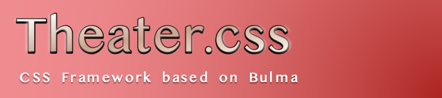

# [Social.css](https://github.com/mtsgi/social-css) / Theater.css

Sekai.css は Bulma を拡張したCSSフレームワークです。

[Social.css](https://github.com/mtsgi/social-css) ファミリーのプロダクトです。

## 📦 Usage

SCSS：`/sass/theater.scss`

CSS：`/css/theater.css`

*Contribution 歓迎します！*
